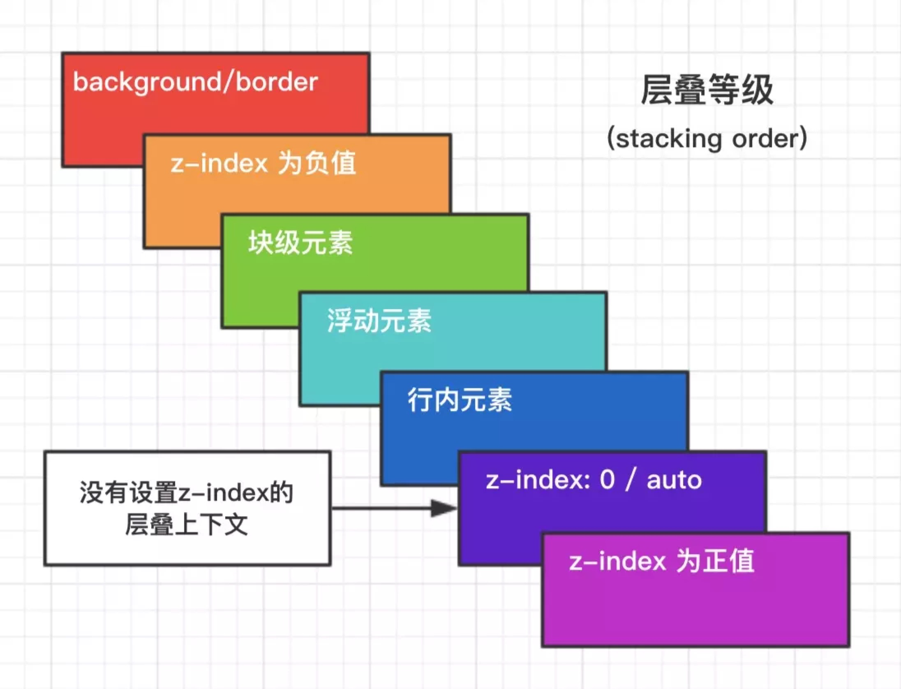

## 盒模型(box-sizing)
- border-box（IE 盒模型）
- content-box (W3C 标准盒模型)

## 块级格式化上下文(Block Formatting Context BFC)
- 具有 BFC 特性的元素可以看作是隔离了的独立容器，容器里面的元素不会在布局上影响到外面的元素
- 常见触发
    - float 不为 none(默认值)
    - overflow 不为 visible(默认值)
    - position 为 absolute || fixed
    - display 为 inline-block || table-cell ||flex
- 规则
    - 同一个 BFC 的两个相邻元素的 margin 会发生重叠
    - BFC 的区域不会与 float 元素重叠
- 常见用法
    - 自适应两栏布局
    - 可以阻止元素被浮动元素覆盖
    - 可以包含浮动元素——清除内部浮动
    - 分属于不同的 BFC 时可以阻止 margin 重叠
```html
## 自适应两栏布局 可以阻止元素被浮动元素覆盖
<div style="height: 100px;width: 100px;float: left;background: lightblue">
    我是一个左浮动的元素
</div>
<div style="height: 200px;background: #eee; overflow: hidden;">
    我是一个没有设置浮动, 也没有触发 BFC 元素
</div>
```
```html
## 可以包含浮动元素——清除内部浮动
<div style="border: 1px solid #000; overflow: hidden">
    <div style="width: 100px;height: 100px;background: #eee;float: left;"></div>
</div>
```

## 层叠水平(stacking level)
- 

## 水平垂直居中
- absolute + transform
- flex + justify-content + align-items
- absolute + left + right + top + bottom + margin
```css
## absolute + transform
.parent {
    position: relative
}
.child {
    position: absolute;
    left: 50%;
    top: 50%;
    transform: translate(-50%, -50%);
}
```
```css
## flex + justify-content + align-items
.parent {
    display: flex;
    justify-content: center;
    align-items: center;
}
```
```css
## absolute + left + right + top + bottom + margin
.child {
    position: absolute;
    left: 0;
    right: 0;
    top: 0;
    bottom: 0;
    margin: auto;
}
```

## 选择器优先级
- !important > 行内样式 > #id > .class > tag > * > 继承 > 默认
- CSS 选择器解析的时候是从右往左(就近原则)

## 外部引用之 link 与 @import 的区别
- 从属关系区别
    - @import 是 CSS 提供的语法规则，只有导入样式表的作用
    - link 是 HTML 提供的标签，不仅可以加载 CSS 文件，还可以定义 RSS、rel 连接属性等
- 加载顺序的差别
    - 加载页面时，link 标签引入的 CSS 被同时加载；@import 引入的 CSS 将在页面加载完毕后被加载

## CSS 动画
- transition
    - transition-property: 属性
    - transition-duration: 间隔
    - transition-timing-function: 曲线
    - transition-delay: 延迟
- transitionend
- animation
    - animation-name: 动画名称，对应@keyframes
    - animation-duration: 间隔
    - animation-timing-function: 曲线
    - animation-delay: 延迟
    - animation-iteration-count: 次数
        - infinite: 循环动画
    - animation-direction: 方向
        - alternate: 反向播放
    - animation-fill-mode: 静止模式
        - forwards: 停止时，保留最后一帧
        - backwards: 停止时，回到第一帧
        - both: 同时运用 forwards / backwards
- animationend

## CSS 函数 calc()
- 进行简单的加减乘除

## CSS 变量
```css
:root {
    --base-height: 100px;
}
.box {
    height: var(--base-height);
}
```

## 响应式
```html
<meta name="viewport" content="width=device-width, initial-scale=1, maximum-scale=1, user-scalable=no">
```
```css
@media screen and (min-width: 800px) and (max-width: 980px) {
    /* ... */
}
```
